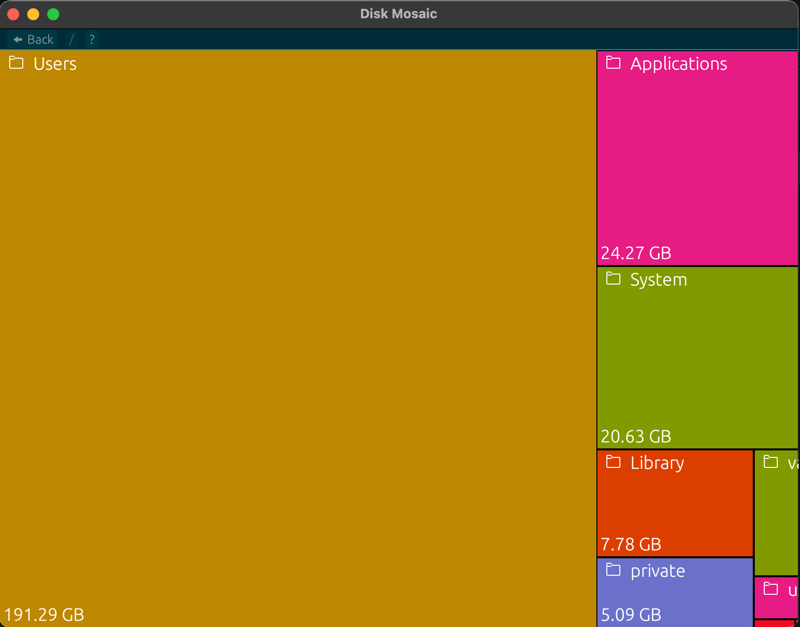

# Disk-Mosaic

## Description

Disk‑Mosaic is a disk‑usage visualization app written in Rust with egui. It scans a folder (or an entire drive) and 
displays the space distribution as a treemap so you can quickly spot which directories and files take the most space.

Note: This is not a disk cleaning tool. It only displays the space distribution to help you spot which directories and 
files take the most space.

## Installation

### Via cargo

cargo install Disk-Mosaic

### Via releases

Some compiled binaries are available in Github releases
