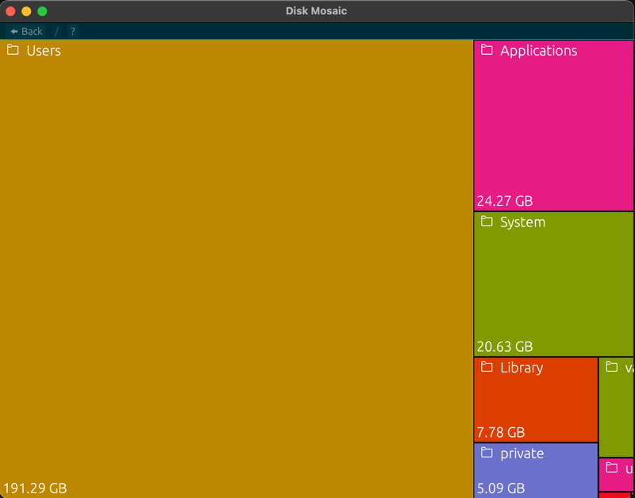

# Disk-Mosaic

## Description

Disk‑Mosaic is a disk‑usage visualization app written in Rust that supports terminal and desktop mode. 
It scans a folder (or an entire drive) and displays the space distribution as a treemap so you can quickly spot which 
directories and files take the most space.


Note: This is not a disk cleaning tool. It only displays the space distribution to help you spot which directories and 
files take the most space but will not delete any file.



## Installation

### Via cargo

#### Desktop version (GUI)

```shellscript
cargo install Disk-Mosaic --features gui
```

#### Terminal version (TUI)

```shellscript
cargo install Disk-Mosaic --bin dm --no-default-features --features tui
```

### Via releases

Some compiled binaries are available in Github releases
